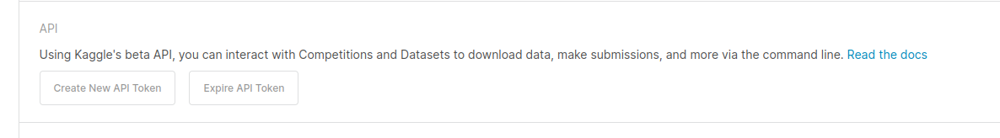

## Previous steps

- Create a virtual environment. I used conda.
- Create a new project in GCP.
- Create a IAM Service Account Key.
- Create a DBT Cloud account 
- Create a Kaggle account.
- Create a Prefect Cloud account. This step is not mandatory.

## Kaggle
To use Kaggle API, we need to have an account.
Go to Account and create New API Token. 


This will download the kaggle.json file. Copy this file in prefect/.kaggle folder

## GCP
- Create a GCP free account
- Create a new project (I've used dezoomcamp-steam)
- Create a Service Account by going to IAM -> Service Accounts -> create a service account
    - To generate a service account, you should include BigQuery Admin, Storage Object Admin, Storage Admin.
    - After creating a service account, in the service account dashboard go to Actions and click manage keys.
    - Click ADD Key -> Create Key -> Select JSON. This will download a json file, save it, you'll need it later.
- Install SDK
- Run the following commands, by updating the correct path for the service account key recently downloaded. This will allow you to have your local setup authenticated with the Cloud SDK.

```shell
export GOOGLE_APPLICATION_CREDENTIALS="<service account key json path>"

gcloud auth application-default login
```
After running the last command, type Y, when prompted and login in the same Google account where you set GCP.

## Terraform
Terraform will be used to create dataset, GCS bucket and tables for ingesting data

- Step 1: Install Terraform in your OS by following ![these instructions[(https://developer.hashicorp.com/terraform/downloads)
- Step 2: Update variables name as needed.
    - Go to terraform folder variables.tf and updated variable names, for each case.
- Step 3: Run terraform to create GCP resources. 
```shell
terraform init

terraform plan

terraform apply
```

Tables for ingestion depends on create dataset resource, meaning Terraform first creates dataset and then tables in that dataset. 

## Prefect

### Run prefect using Docker
To create a deployment in Prefect using Docker, I created a Docker image in Prefect folder. The steps followed to create the image were 

```shell
#update image name with your Docker image
docker image build -t aliescont/steam-reviews:dezoomcamp .

docker login 

docker image push aliescont/steam-reviews:dezoomcamp
```

### Prefect Blocks
Blocks in Prefect allow us to interact with other tools in a safe environment. In this project blocks are set through Python scripts.

For GCP credentials block, you'll need to copy your service account key in make_gcp_blocks.py. Make sure to keep this information private.

```shell
#block needed to upload data into GCS and BigQuery. 
python blocks/make_gcp_blocks.py
```

After the Docker image is pushed to Docker Hub, update blocks/make_docker_blocks.py with Docker image and run Python script to create a Docker block in Prefect.

```shell
#create a Docker block to run deployment using a Docker image
python make_docker_blocks.py

```
To run dbt models using a Prefect deployment, we'll need to create blocks for dbt CLI profile and targer config for BigQuery. This will allow to run dbt commands using GCP credentials blocks, without the need to create profiles.yml. Update for profile variables, as needed in blocks/make_dbt_creds_cli_block.py

```shell
#Create a block for dbt cli to use prefect-dbt to run models using a Prefect deployment
python make_dbt_creds_cli_block.py
```

This blocks can be also configured using the Prefect UI.


### Prefect deployments

After creating Prefect blocks, we're able to create Prefect deployments

#### Step 1 -> First, run python scripts to create deployments

```shell
python3 docker-deploy.py
```

This will create a deployment in the prefect UI called kaggle-to-gcs/docker-ingest-flow that will download data from Kaggle and ingest it in batches in a GCS bucket.

```shell
python3 docker-bq-deploy.py
```

This will create a deployment in the prefect UI called etl-gcs-to-bq/docker-bq-flow that will ingest data from GCS bucket to BigQuery tables, which are going to be used as sources in dbt for do transformations.


```shell
python3 dbt_cli_deploy.py
```

This will create a deployment in the prefect UI called trigger-dbt-cli-run/dbt-core-cli-run that will create dbt models in production dataset.

#### Step 2 -> set Prefect agent to run deployments

To set the Profile to start agent in Prefect to run the deployment you need to set the PREFECT_API_URL

```shell
prefect config set PREFECT_API_URL=http://127.0.0.1:4200/api

prefect agent start -q default
```

#### Step 3 -> Run deployments

First, download datasets and ingest data into GCS bucket

```shell
prefect deployment run kaggle-to-gcs/docker-ingest-flow
```

Then, ingest data in buckets into BigQuery

```shell
prefect deployment run etl-gcs-to-bq/docker-bq-flow 
```

Finally, run dbt models in dbt cli
```shell
prefect deployment run trigger-dbt-cli-run/dbt-core-cli-run
```

## DBT Cloud
In Prefect section we're using dbt core to run dbt models in production. Another option is to run dbt cloud
Step 1 -> Create a dbt cloud account. 
Step 2 -> Fork this repo.
Step 3 -> Connect your dbt cloud account with Github repo where you fork this repo.
Step 4 -> In the Account settings of your dbt cloud account make sure to use service account key downloaded before.
Step 5 -> After running prefect flows for ingesting data into a Data Lake and then into BigQuery, update sources in dbt project as needed with the corresponding project_id and create a dbt cloud job with dbt run command.
Step 6 -> Run dbt job to visualize data.